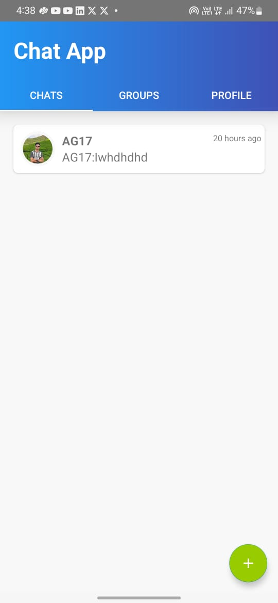
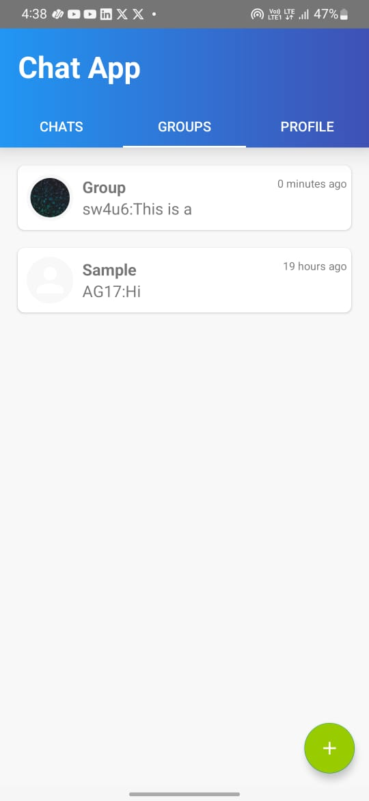
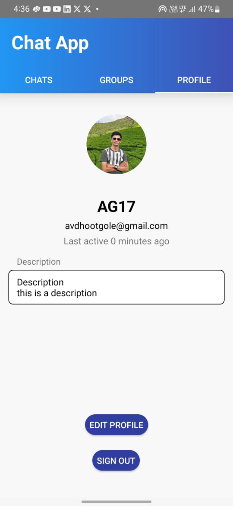
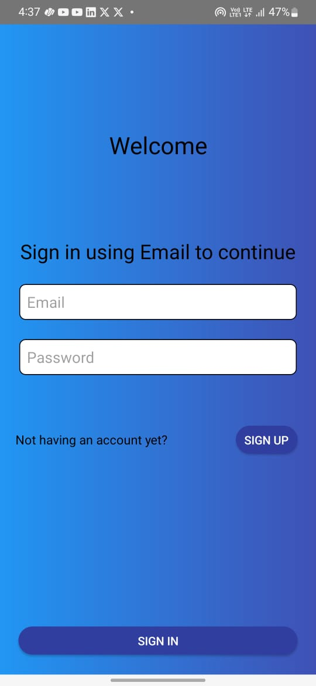
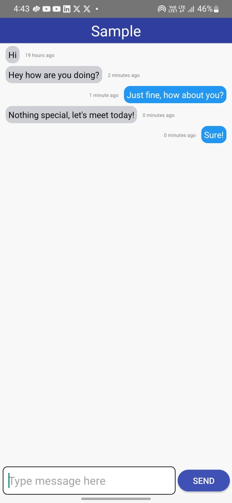
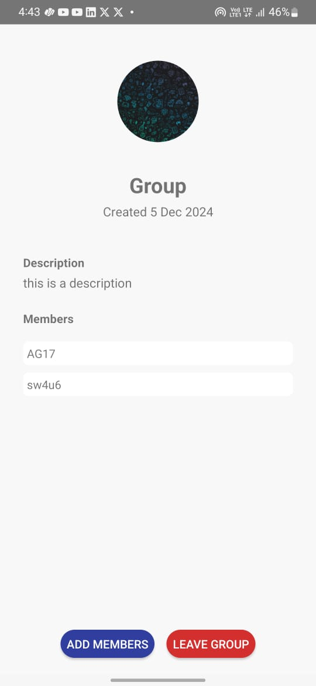

<!DOCTYPE html>
<html lang="en">
<head>
    <meta charset="UTF-8">
    <meta name="viewport" content="width=device-width, initial-scale=1.0">
</head>
<body>

<h1>💬 Chatting Application</h1>

A real-time Android chat app with <b>one-on-one and group messaging</b>, built using <b>Firebase Firestore, Authentication, and Cloud Storage</b>.

<h2>🚀 Features</h2>
<ul>
    <li><b>Real-time Messaging:</b> Supports both <b>one-on-one and group chats</b> with instant synchronization via Firebase Firestore.</li>
    <li><b>Secure Authentication:</b> Implemented Firebase Authentication for user login and signup.</li>
    <li><b>Modern UI:</b> Designed with <code>ViewPager2</code>, <code>SplashScreen</code>, and <code>RecyclerView</code> for a smooth user experience.</li>
    <li><b>MVVM Architecture:</b> Uses <code>LiveData</code> and Jetpack components for a scalable and maintainable structure.</li>
</ul>

<h2>🛠️ Tech Stack</h2>
<ul>
    <li><b>Languages:</b> Java, XML</li>
    <li><b>Backend:</b> Firebase Firestore, Firebase Authentication, Firebase Cloud Storage</li>
    <li><b>Android Components:</b> ViewPager2, RecyclerView, LiveData, Jetpack Components</li>
</ul>

<h2>📸 Screenshots</h2>

Here are some previews of the Chatting App:

    
    
    
    
    
    

<h2>📥 Installation</h2>
<ol>
    <li>Clone the repository:</li>
    <pre><code>git clone https://github.com/AG1713/Chatting-Application.git</code></pre>
    <li>Open the project in <b>Android Studio</b>.</li>
    <li>Build and run the app on an emulator or a physical device.</li>
</ol>

<h2>🔮 Future Enhancements</h2>
<ul>
    <li>🚀 <b>Image & File Sharing:</b> Allow users to send multimedia files.</li>
    <li>🚀 <b>Custom Themes:</b> Dark mode and customizable chat themes.</li>
</ul>

<h2>🤝 Contributions</h2>

Feel free to fork the repo and submit PRs for improvements! 🚀

</body>
</html>
